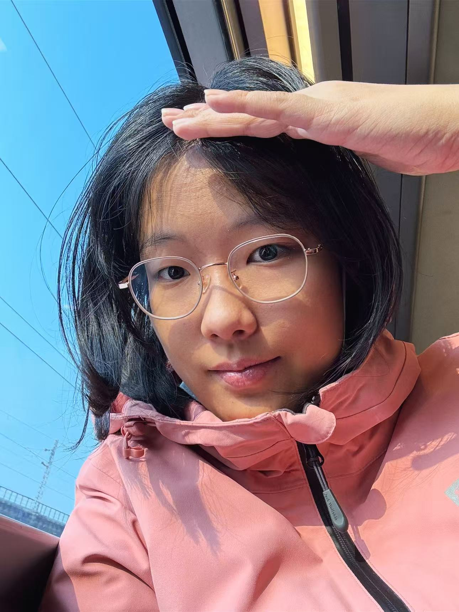
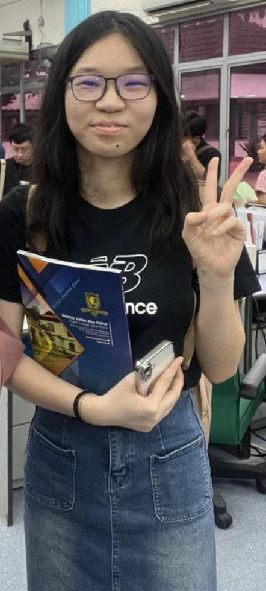
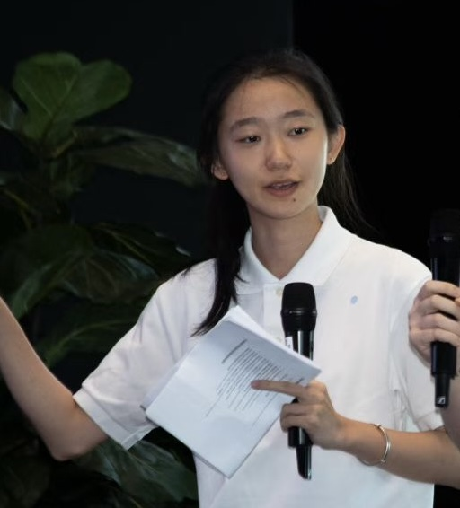

We are a team based in the [School of Computing, National University of Singapore](https://www.comp.nus.edu.sg).

You can reach us at the email `seer[at]comp.nus.edu.sg`

## Project team

### Gao Huiying

[[github](https://github.com/ghyyuan)]

* Role: Project Advisor

### Brenda Tan

[[github](https://github.com/brenda77777)]

* Role: Project Advisor

### Xingchen

[[github](https://github.com/Xingchen722]

* Role: Tech Lead
* Responsibilities: software development

### Johnny Doe

[[github](http://github.com/johndoe)] [[portfolio](team/johndoe.md)]

* Role: Developer
* Responsibilities: Data

### Jean Doe

[[github](http://github.com/johndoe)]
[[portfolio](team/johndoe.md)]

* Role: Developer
* Responsibilities: Dev Ops + Threading

### James Doe

[[github](http://github.com/johndoe)]
[[portfolio](team/johndoe.md)]

* Role: Developer
* Responsibilities: UI
