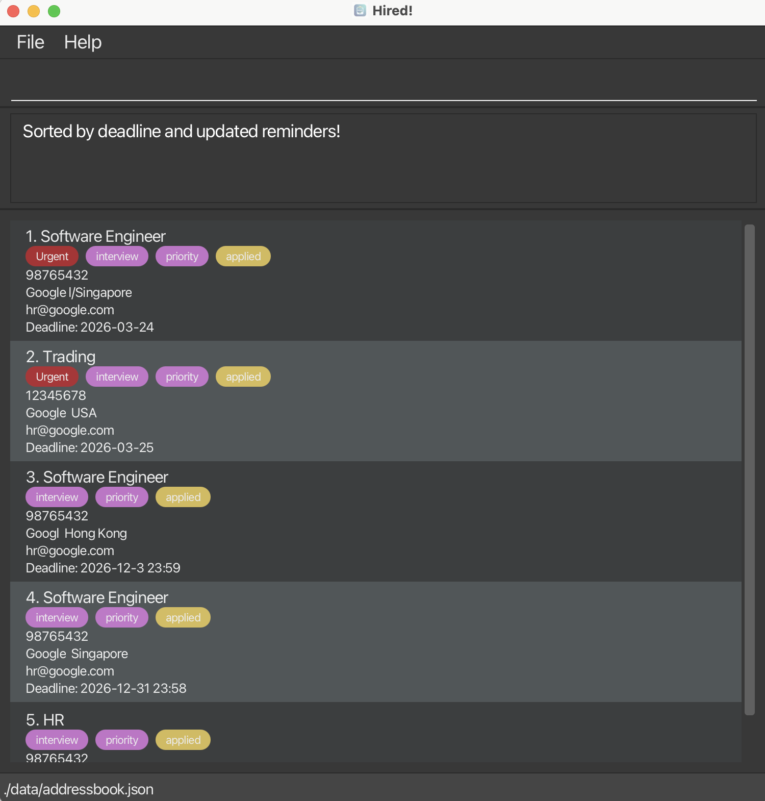
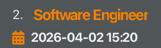
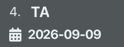

Hired! is a **desktop app for managing internship applications, optimized for use via a Command Line Interface** (CLI) while still providing the benefits of a Graphical User Interface (GUI).

If you can type fast, Hired! can help you manage your internship applications more efficiently than traditional GUI apps (like Google Sheet, Word).

* Table of Contents
  {:toc}

--------------------------------------------------------------------------------------------------------------------

## Quick start

1. Ensure you have Java `17` or above installed on your computer. 
   You can download the [Oracle version](https://www.oracle.com/java/technologies/downloads/#java17) or another alternative such as the OpenJDK version. 
   **Mac users:** Ensure you have the precise JDK version prescribed [here](https://se-education.org/guides/tutorials/javaInstallationMac.html).

2. Download the latest `.jar` file from the [project release page](https://github.com/AY2526S2-CS2103T-T13-3/tp/releases/tag/v1.0).

3. Copy the file to the folder you want to use as the _home folder_ for Hired!.

4. Open a command terminal, `cd` into the folder you put the jar file in, and run the application using `java -jar hired.jar`. 
   In case you are curious about how to deal with `cd`, here is [a simple tutorial](https://www.ibm.com/docs/en/aix/7.1.0?topic=directories-changing-another-directory-cd-command). 
   A GUI similar to the one below should appear in a few seconds. Note that the app contains some sample application records. 
   Moreover, it is normal to see some warning messages printed on your terminal. 
   

5. Type the command in the command box and press Enter to execute it. For example, typing **`help`** and pressing Enter will open the help window. 
   Some example commands you can try to have a taste of **Hired!**:

    * `list` : Lists all existing application records.
    * `add r/Software Engineer p/98765432 e/hr@google.com c/Google t/interview note/Met recruiter at career fair` : Adds an application record for a Software Engineer role at Google with a note.
    * `findnote recruiter` : Finds applications whose notes contain `recruiter`.
    * `delete 3` : Deletes the 3rd application shown in the current list.
    * `clear` : Deletes all application records.
    * `exit` : Exits our app.

6. Refer to the [Features](#features) below for details of each command.

--------------------------------------------------------------------------------------------------------------------

## Features

**:information_source: Notes about the command format:** 

* Words in `UPPER_CASE` are parameters to be supplied by the user. 
  e.g. in `add r/ROLE`, `ROLE` is a parameter which can be used as `add r/Software Engineer`.

* Items in square brackets are optional. 
  e.g. `r/ROLE [t/TAG]` can be used as `r/Software Engineer t/interview` or as `r/Software Engineer`.

* Items with `…` after them can be used multiple times including zero times. 
  e.g. `[t/TAG]...` can be used as ` ` (i.e. 0 times), `t/interview`, `t/interview t/priority` etc.

* Parameters can be in any order. 
  e.g. if the command specifies `r/ROLE p/PHONE`, `p/PHONE r/ROLE` is also acceptable.

* Extraneous parameters for commands that do not take in parameters (such as `help`, `list`, `exit` and `clear`) will be ignored. 
  e.g. if the command specifies `help 123`, it will be interpreted as `help`.

* If you are using a PDF version of this document, be careful when copying and pasting commands that span multiple lines, as space characters surrounding line-breaks may be omitted when copied over to the application.

### Viewing help : `help`

Shows a message explaining how to access the help page.

Format: `help`

### Adding an application: `add`

Adds an application record to Hired!.

Format: `add r/ROLE p/PHONE e/EMAIL c/COMPANY_NAME [l/COMPANY_LOCATION] [t/TAG]... [note/NOTE]`

**Required prefixes:** `r/`, `p/`, `e/`, and `c/` must be provided for a valid `add` command.

**Optional prefixes:** `l/`, `t/`, and `note/` are optional. If provided, they may appear in any order after the required fields.

> **Note:** In Hired!,
> * `r/` is used for the internship role,
> * `c/` is used for the company name, and
> * `l/` (optional) is used for the company location.
>
> Applications are considered duplicates (and cannot be added) only when they have the same identity:
> 1) the same `role`,
> 2) the same `company name`, and
> 3) the same `company location`:
     >    * if both locations are empty (e.g. `l/` is omitted), they are treated as the same;
>    * if one location is empty and the other is not, they are treated as different.
       > **Tip:** An application can have any number of tags (including 0).
       > **Tip:** A note can be added when creating an application by using `note/`.

Examples:
* `add r/Software Engineer p/98765432 e/hr@google.com c/Google`
* `add r/Software Engineer p/98765432 e/hr@google.com c/Google l/Singapore`
* `add r/Software Engineer p/98765432 e/hr@google.com c/Google t/interview t/priority`
* `add r/Software Engineer p/98765432 e/hr@google.com c/Google l/Boon Lay t/interview`
* `add r/Data Analyst p/92345678 e/recruitment@meta.com c/Meta l/Singapore t/applied note/Met recruiter at career fair`

### Listing all applications : `list`

Shows a list of all application records in Hired!.

Format: `list`

### Editing an application : `edit`

Edits the details of an existing application in Hired!.

Format: `edit INDEX [r/ROLE] [p/PHONE] [e/EMAIL] [c/COMPANY_NAME] [l/COMPANY_LOCATION] [t/TAG] [s/STATUS] [d/DEADLINE]... [note/NOTE]`

* Edits the application at the specified `INDEX`.
* The index refers to the index number shown in the displayed application list.
* The index **must be a positive integer** `1, 2, 3, ...`
* At least one of the optional fields must be provided.
* Existing values will be overwritten by the input values.
* When editing tags, the existing tags of the application will be removed, i.e. tag editing is not cumulative.
* You can remove all tags by typing `t/` without specifying any tag after it.
* You can edit an application's note using `note/NOTE`.
* You can clear an existing note by typing `note/` with nothing after it.

Examples:
* `edit 1 p/91234567 e/hr@google.com` edits the phone number and email of the 1st application.
* `edit 2 r/Backend Engineer c/Shopee` edits the role and company of the 2nd application.
* `edit 3 t/urgent t/interview` replaces the tags of the 3rd application with `urgent` and `interview`.
* `edit 4 t/` removes all tags from the 4th application.
* `edit 1 note/Follow up next Monday` updates the note of the 1st application.
* `edit 1 note/` clears the note of the 1st application.

### Locating applications by role: `find`

Finds applications whose roles contain any of the given keywords.

Format: `find KEYWORD [MORE_KEYWORDS]`

* The search is case-insensitive. e.g. `engineer` will match `Engineer`
* The order of the keywords does not matter.
* Only the role is searched.
* Partial words will also be matched. e.g. `eng` will match `Engineer`
* Applications matching at least one keyword will be returned, if given more than 1 keyword (i.e. `OR` search).

Examples:
* `find engineer` returns applications with roles containing `engineer`
* `find backend frontend` returns applications with roles containing `backend` or `frontend`

### Locating applications by note: `findnote`

Finds applications whose notes contain any of the given keywords.

Format: `findnote KEYWORD [MORE_KEYWORDS]`

* The search is case-insensitive. e.g. `follow` will match `Follow`
* The order of the keywords does not matter.
* Only the note field is searched.
* Partial words will also be matched. e.g. `rec` will match `recruit`
* Applications matching at least one keyword will be returned (i.e. `OR` search).

Examples:
* `findnote recruiter` returns applications with notes containing `recruiter`
* `findnote follow Monday` returns applications with notes containing `follow` or `Monday`

### Changing the default status: `status`

* Changes the status of an application to APPLIED, INTERVIEWING, OFFERED, REJECTED, or WITHDRAWN.
* The accepted input keywords are apply, interviewing, offered, rejected, and withdraw, and they are not case-sensitive.

Format: `status INDEX s/STATUS`

* Edits the application at the specified `INDEX`.
* The index refers to the index number shown in the displayed application list.
* The index **must be a positive integer** `1, 2, 3, ...`
* * The status is case-insensitive. e.g. `REJECTED` will turn out to be `rejected`
* Only status given above can be chosen.
* Only one application can be changed at a time.
* Status will appear as a tag in the UI.

Examples:
* `status 1 s/OFFERED` changes the status to `offered`
* `status 1 s/selected` will result in an error as `selected` is not a given status.

### Setting the deadline for an application : `deadline`

Sets or updates the deadline for the application identified by its index.

Format: `deadline INDEX DATE_TIME`

* The `DATE_TIME` can be `yyyy-MM-dd`, `yyyy-MM-dd HH:mm`.
* Our app do not accept `yyyy-MM-dd HH:60` or any invalid date and time
* The index refers to the index number shown in the displayed application list.
* This deadline is used by `reminder` and `sort time`.

Examples:
* `deadline 1 2026-12-31`
* `deadline 1 2026-12-31 23:59`

Tips: Note that we can change deadline and status by either using their own command, or using the general edit command.
Examples:
* `status 1 s/OFFERED` is equivalent to `edit 1 s/OFFERED`
* `deadline 2 2026-03-25` is equivalent to `edit 2 d/2026-03-25`
  This is intended to give user more flexibility in entering command.
  This is a feature not a bug.

### Deleting an application : `delete`

Deletes the specified application record from Hired!.

Format: `delete INDEX`

* Deletes the application at the specified `INDEX`.
* The index refers to the index number shown in the displayed application list.
* The index **must be a positive integer** `1, 2, 3, ...`

Examples:
* `list` followed by `delete 2` deletes the 2nd application in the displayed list.
* `find engineer` followed by `delete 1` deletes the 1st application in the results of the `find` command.

### Identifying urgent applications : `reminder`

Identifies and highlights applications according to how close their `deadline` is to the current local time.
This feature is UI-only: it does **not** add or remove any tags.

Format: `reminder`

* After executing `reminder`, the application list is re-sorted by `deadline` in ascending order (nearest first).
* Applications with no deadline (i.e. deadline is `-` / "No deadline set") are placed at the bottom and are not highlighted.
* Highlighting is based on the comparison between each application's `deadline` and your current local time:
    * **Red** `role` text: the deadline is within the next **3 days**, including today.
    * 
    * **Orange** `role` text: the deadline is already **in the past** (i.e. earlier than the current local time).
    * 
    * Otherwise, `role` keeps the default color (white).
    * 
* Once you have executed `reminder`, the highlighting preference is saved, so restarting the app will keep the red/orange coloring behaviour.
* Deadline format affects how the comparison is done:
    * If you enter `deadline` as `yyyy-MM-dd`, it is treated as a date and compared using the day window (end of day is handled implicitly for highlighting).
    * If you enter `deadline` as `yyyy-MM-dd HH:mm`, the comparison is accurate to **minutes**.
* Interaction with `deadline` and `edit`:
    * If you change a deadline using `deadline INDEX DATE_TIME` or `edit INDEX d/DATE_TIME`, the UI will re-render and the `role` color will immediately reflect the updated deadline (red/orange based on current local time).
    * The **list order** is re-sorted by deadline **only** when you run either:
        * `reminder`, or
        * `sort time`.

* Updating color at an exact time point (datetime `yyyy-MM-dd HH:mm`):
    * **Precondition:** You have already executed `reminder` at least once in this application (otherwise the highlighting is kept disabled and the `role`/calendar icon will stay at default colors until you run `reminder`).
    * Suppose your current local time is `2026-04-02 15:48` and you set an application deadline to `2026-04-02 15:48` (using `deadline INDEX 2026-04-02 15:48` or `edit INDEX d/2026-04-02 15:48`).
    * After setting the deadline:
        * If the current time is still within the same minute (e.g. `15:48:00`), the deadline is **not considered overdue yet** and the `role` stays **red**.
    * After the deadline minute has passed (e.g. `15:48:01` or any time after that), the deadline becomes **overdue** per the rule above.
    * To make the UI apply the new color at that moment:
        * Click the corresponding application list item (the big box / card area of that `INDEX`) so that the UI re-renders that card, **or**
        * Enter `reminder`.
    * Note: this action refreshes **colors** (to reflect the newly overdue deadline).

### Sorting applications : `sort`

Sorts the current list of applications based on a specified criterion.

Format: `sort [CRITERION]`

* The `CRITERION` must be either `time` or `alphabet`.
* `sort time`: Sorts applications by their deadline (nearest first). Applications without deadlines are placed at the bottom.
* `sort alphabet`: Sorts applications alphabetically by their role name (A-Z).

Examples:
* `sort time`
* `sort alphabet`

### Undoing previous commands : `undo`

Undoes the most recent command that modified the application list.

Format: `undo`

* Keeps track of up to 10 steps of your command history.
* Commands that can be undone include add, delete, edit, clear, status, reminder, deadline, sort, assessment, and removeevent.
* You cannot undo if there are no more states to revert to in the history.

Examples:
* `delete 1` followed by `undo` restores the deleted application.

### Redoing undone commands : `redo`

Reverses the most recent `undo` command.

Format: `redo`

* You must perform at least one `undo` command before you can use `redo`.
* If you attempt to redo when no undoable state exists, an error message "No undoable state to redo. Please perform an undo first." will be shown.
* If you execute a data-modifying command (e.g.,`add`) after an undo, the `redo` **history** is cleared.

Examples:
* clear followed by `undo` (restores data), then `redo` (clears data again).

### Attaching your resume : `resume`

Attaches your resume to a specific application.

Format: `resume INDEX rp/RESUME_PATH` / `openresume INDEX` / `removeresume INDEX`

* Edits the application at the specified `INDEX`.
* The index refers to the index number shown in the displayed application list.
* The index **must be a positive integer** `1, 2, 3, ...`
* You must specify the path of you resume。
* This feature will not save your resume in the storage, but just a reference to your own documentation.
* Please don't change the path of the file or it will result in unexpected errors.

Examples:
* `resume 1 rp/C:\Users\qiyu\Documents\resume.pdf` will attach your resume to the first application.

### Setting an online assessment : `assessment`

Attaches online assessment details to a specific application. Once set, an **Event** button will appear on the application card — clicking it opens a window showing the full event details.

Format: `assessment INDEX el/LOCATION et/DATE_TIME ap/PLATFORM al/LINK`

* Sets the online assessment for the application at the specified `INDEX`.
* The index refers to the index number shown in the displayed application list.
* The index **must be a positive integer** `1, 2, 3, ...`
* All four prefixes are **required**:
    * `el/` — location of the assessment (e.g. `home`, `office`).
    * `et/` — date and time of the assessment in `yyyy-MM-dd HH:mm` format.
    * `ap/` — platform used for the assessment (e.g. `HackerRank`, `Codility`).
    * `al/` — link to the assessment (e.g. `www.hackerrank.com`).
* If the application already has an assessment, running `assessment` again will **overwrite** the existing one.
* To remove an existing assessment, use the [`removeevent`](#removing-an-online-assessment--removeevent) command.

> **Note:** The datetime must be in `yyyy-MM-dd HH:mm` format exactly. Invalid dates or times (e.g. `2026-13-01 10:00` or `2026-03-24 10:60`) will not be accepted.

Examples:
* `assessment 1 el/home et/2026-03-24 10:00 ap/HackerRank al/www.hackerrank.com`
* `assessment 2 el/office et/2026-06-15 14:30 ap/Codility al/www.codility.com`

### Removing an online assessment : `removeevent`

Removes the online assessment (event) attached to a specific application.

Format: `removeevent INDEX`

* Removes the event from the application at the specified `INDEX`.
* The index refers to the index number shown in the displayed application list.
* The index **must be a positive integer** `1, 2, 3, ...`
* If the application at the given index does not have an event, an error message will be shown and no changes will be made.
* After a successful removal, the **Event** button on the application card will be hidden.
* This action can be undone using `undo`.

Examples:
* `removeevent 1` removes the online assessment from the 1st application.
* `removeevent 3` removes the online assessment from the 3rd application.

### Clearing all entries : `clear`

Clears all application records from Hired!.

Format: `clear`

### Exiting the program : `exit`

Exits the program.

Format: `exit`

### Saving the data

Hired! data are saved automatically to the hard disk after any command that changes the data. There is no need to save manually.

### Editing the data file

Hired! data are saved automatically as a JSON file at `[JAR file location]/data/applicationList.json`. Advanced users may update data directly by editing that file.

:exclamation: **Caution:**
If your changes to the data file make its format invalid, Hired! may discard all data and start with an empty data file at the next run. Hence, it is recommended to take a backup of the file before editing it. 
Furthermore, certain edits can cause Hired! to behave in unexpected ways (for example, if a value entered is outside the acceptable range). Therefore, edit the data file only if you are confident that you can update it correctly.

### Archiving data files `[coming in v2.0]`

_Details coming soon ..._

--------------------------------------------------------------------------------------------------------------------

## FAQ

**Q**: How do I transfer my data to another computer? 
**A**: Install Hired! on the other computer and overwrite the empty data file it creates with the data file from your previous Hired! home folder.

--------------------------------------------------------------------------------------------------------------------

## Known issues

1. **When using multiple screens**, if you move the application to a secondary screen, and later switch to using only the primary screen, the GUI will open off-screen. The remedy is to delete the `preferences.json` file created by the application before running the application again.
2. **If you minimize the Help Window** and then run the `help` command (or use the `Help` menu, or the keyboard shortcut `F1`) again, the original Help Window will remain minimized, and no new Help Window will appear. The remedy is to manually restore the minimized Help Window.

--------------------------------------------------------------------------------------------------------------------

## Command summary

Action | Format, Examples
--------|------------------
**Add** | `add r/ROLE p/PHONE e/EMAIL c/COMPANY_NAME [l/COMPANY_LOCATION] [t/TAG]... [note/NOTE]`   e.g. `add r/Data Analyst p/92345678 e/recruitment@meta.com c/Meta l/Singapore t/applied note/Met recruiter at career fair`
**Clear** | `clear`
**Delete** | `delete INDEX`  e.g. `delete 3`
**Edit** | `edit INDEX [r/ROLE] [p/PHONE] [e/EMAIL] [c/COMPANY_NAME] [l/COMPANY_LOCATION] [t/TAG]... [note/NOTE]`  e.g. `edit 1 note/Follow up next Monday`
**Find** | `find KEYWORD [MORE_KEYWORDS]`  e.g. `find engineer backend`
**Find Note** | `findnote KEYWORD [MORE_KEYWORDS]`  e.g. `findnote recruiter follow`
**List** | `list`
**Status** | `status INDEX s/STATUS`   e.g. `status 2 s/offered`
**Deadline** | `deadline INDEX DATE_TIME`   e.g. `deadline 1 2026-12-31 23:59`
**Reminder** | `reminder`   Re-sorts by deadline (nearest first) and highlights the `role` color based on current local time: red within 3 days (incl. today), orange if overdue, default is white.
**Sort** | `sort [CRITERION]`   CRITERION: `time` or `alphabet`   e.g. `sort time`, `sort alphabet`
**Undo** | `undo`   Reverts the most recent data-modifying command (up to 10 steps).
**Redo** | `redo`   Reapplies the most recently undone command.
**Resume** | `resume INDEX rp/RESUME_PATH`   Attaches a resume to a specific application.
**Assessment** | `assessment INDEX el/LOCATION et/DATE_TIME ap/PLATFORM al/LINK`   e.g. `assessment 1 el/home et/2026-03-24 10:00 ap/HackerRank al/www.hackerrank.com`
**Remove Event** | `removeevent INDEX`   e.g. `removeevent 1`
**Exit** | `exit`
**Help** | `help`

## Future Improvement
